# DIU26
Prácticas Diseño Interfaces de Usuario (Tema: Sabores con Encanto ) 

Actualizado: 14/04/2026

## Paso 0. Mi UX-Case Study
 
-----

**Grupo:** DIU2_UrsMas.  **Curso:** 2025/26 

**Nombre del Proyecto:** Rediseño Web de La Qarmita 

**Descripción:** Plataforma digital diseñada para trasladar la experiencia de "ocio lento" de **La Qarmita** (un espacio híbrido que une cafetería y librería en Granada) al entorno online. Nuestro objetivo es crear una web intuitiva que elimine las fricciones actuales del negocio físico, integrando una carta gastronómica digital accesible, una tienda de libros optimizada con filtros, un sistema de gestión y reserva de eventos culturales, y un foro de reseñas para fomentar la comunidad lectora.

**Logotipo:** 

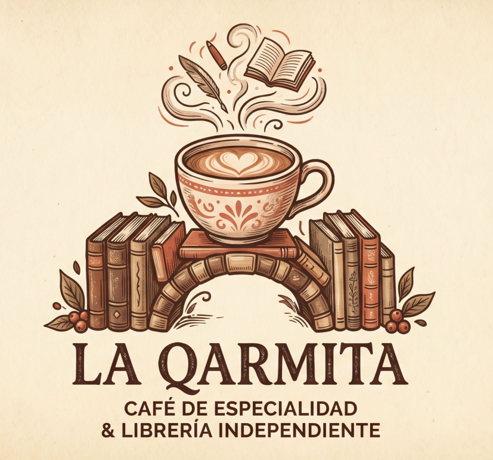

*(Logotipo y eslogan en desarrollo para la Práctica 3)*

### UrsMas Team

**Integrantes:**

* **Tomás Serrano Borrego** — [Visitar Perfil :octocat:](https://github.com/tomaas05)
* **Úrsula Barato Berdugo** — [Visitar Perfil :octocat:](https://github.com/UrsulaUGR05)

-----
# Proceso de Diseño 

 

## Paso 1. UX User & Desk Research & Analisis

---

### 1.a User Research Plan

#### Contexto y Definición del Proyecto
El proyecto seleccionado para la investigación se centra en **La Qarmita**, un espacio que redefine el concepto tradicional de hostelería en **Granada**. Más allá del servicio de cafetería, analizamos este lugar como un punto de encuentro cultural donde convergen la gastronomía y la literatura.

Nuestra premisa es que La Qarmita ofrece una experiencia de **"ocio lento"**. El reto principal es traducir ese **engagement emocional** del mundo físico (el olor a café, la tranquilidad de la lectura) al entorno digital. Buscamos crear un espacio que combine públicos diversos: desde aquellos que buscan un "lugar chulo" para tomar algo, hasta lectores que acuden a eventos, compran libros o buscan nuevos círculos sociales.

#### Background del Equipo
Queremos destacar que **anteriormente no hemos tenido mucho contacto con el desarrollo de páginas web** ni con el análisis de negocios en profundidad. Por tanto, afrontamos este proyecto como una oportunidad de aprendizaje activo, donde iremos adquiriendo estas competencias técnicas a medida que avance el trabajo.

Sin embargo, en cuanto a **ocio y lectura**, nuestra experiencia es mucho más cercana, tanto por conocidos como por nuestras propias impresiones. Esto nos permite partir con una base sólida de **empatía** hacia el usuario, ayudándonos a acotar mejor sus necesidades y frustraciones reales al buscar este tipo de experiencias.

#### Objetivos de la Investigación
Buscamos resolver problemas reales de los usuarios y generar valor competitivo. Nos centraremos en los siguientes puntos clave:

1.  **Superar la "Regla de los 5 segundos":** Diseñar una interfaz clara donde el usuario entienda qué es La Qarmita y qué ofrece (café + cultura) en menos de 5 segundos, evitando el abandono por confusión.
2.  **Visibilidad de la Agenda (Engagement):** Que los eventos (clubes de lectura, presentaciones) sean fáciles de encontrar para "atrapar" al usuario y fomentar la comunidad.
3.  **Conversión y Afluencia:** Reducir la fricción para quien busca información básica (horarios, ubicación), facilitando la visita física.
4.  **Posicionamiento "Lifestyle":** Proyectar una imagen vibrante que conecte emocionalmente no solo con lectores, sino con grupos que buscan un ambiente *trendy* y de calidad.
5.  **Conexión Comunidad-Local:** Facilitar que la web sirva para recomendar lecturas y conectar a personas con intereses similares, extendiendo la experiencia física al mundo online.

#### Estrategia y Metodología
Para validar nuestras hipótesis y mejorar la interfaz, seguiremos una estrategia centrada en el usuario (UCD). Esta estrategia estará basada en realizar **análisis comparativos** con plataformas similares para entender el mercado.

Posteriormente, desarrollaremos la creación de **personas ficticias** que nos ayuden a entender mejor al público objetivo, así como **User Journey Maps** para visualizar y mejorar la interacción con nuestra página. Finalmente, se realizará un **Usability Review** que identifique problemas técnicos y de navegación en la propuesta actual.

#### Métricas y KPIs (Indicadores de Éxito)
Para evaluar si estamos mejorando la experiencia y reduciendo la frustración del usuario, nos centraremos en analizar cuatro aspectos fundamentales sin perdernos en tecnicismos excesivos:

* **Atención Inicial:** Verificaremos si cumplimos con la "regla de los 5 segundos", observando si el usuario entiende la web rápidamente o si la tasa de rebote es alta.
* **Eficiencia:** Mediremos la facilidad con la que se encuentra la información clave (como un evento), buscando que la "carga mental" sea la mínima posible.
* **Satisfacción Emocional:** Evaluaremos, mediante la opinión de los usuarios, si la web transmite las sensaciones de "refugio", "calidad" y "seguridad" que definen a la marca.
* **Alcance Generacional:** Indagaremos en las sensaciones que les produce el sitio web a diferentes perfiles, asegurando que sea atractivo tanto para nativos digitales como para lectores más tradicionales.

---

### 1.b Competitive Analysis

Para el análisis competitivo hemos seleccionado dos sitios web estratégicos: uno que comparte el modelo de negocio híbrido (Café + Lectura) y otro que representa la competencia tradicional en nuestra ubicación (Granada).

#### Los Competidores:

* **Q Pro Quo:** Librería-Café universitaria situada cerca del campus de Málaga. Además de libros y café, organiza eventos y ofrece servicios de papelería y regalos (llaveros, botellas temáticas...).
    * *Web:* [www.qproquo.com](https://www.qproquo.com/es/index.php)
* **Café Fútbol:** Cafetería, heladería y churrería tradicional con más de 100 años de historia en el centro de Granada. Cuenta también con servicio de restaurante.
    * *Web:* [cafefutbol.com](https://cafefutbol.com/)
* **La Qarmita (Nuestro caso):** [laqarmita.es](https://laqarmita.es/)

#### Primera impresión (Look & Feel)

Al analizar la primera impresión (**Look & Feel**), detectamos **estrategias claramente opuestas**. Por un lado, tanto **Café Fútbol** como **La Qarmita** logran **transmitir la atmósfera del local**, apostando por un apartado visual coherente que comunica eficazmente el ambiente de cafetería y refuerza su **identidad física** en el entorno digital.

En contraposición, **Q Pro Quo pierde impacto e interés rápidamente**, al presentar una imagen poco distintiva que **prioriza un catálogo de libros estilo e-commerce**. Esta decisión visual **diluye su propuesta híbrida** de “lectura + café” y no consigue trasladar la **experiencia diferencial** que promete el espacio físico.

#### Funcionalidad y objetivo principal del usuario

Profundizando en la **funcionalidad y el objetivo principal** del usuario (consultar la oferta gastronómica), encontramos **puntos de fricción significativos**.

**Q Pro Quo** genera **incertidumbre al no mostrar opciones de consumición** de forma clara, ocultando la parte de “cafetería” del negocio y obligando al usuario a reinterpretar la propuesta.

Por su parte, aunque **Café Fútbol** es un referente local, su **experiencia digital decae** al obligar al visitante a elegir entre “cafetería” o “restaurante” nada más entrar, **fragmentando el flujo natural** de exploración. Posteriormente, ofrece la carta en un **PDF incrustado y mal optimizado**, un formato que rompe la **jerarquía visual**, dificulta la escaneabilidad y se aleja de los **estándares actuales de usabilidad**.

En contraste, **La Qarmita** presenta una carta bien localizada, **estructurada en HTML**, con **fotografías identificativas**, descripción de ingredientes y precios visibles. Esto facilita una **lectura cómoda**, mejora la jerarquía de la información y reduce la **fricción cognitiva**.

#### Storytelling e Identidad de Marca

En cuanto al **Storytelling**, las **diferencias estratégicas** son evidentes.

**Café Fútbol** construye su narrativa alrededor de la **tradición y el pasado**, pero incurre en repetición y deja en segundo plano su **propuesta actual**. Existe una **desalineación** entre el contexto de uso del usuario —que busca información práctica inmediata— y una narrativa excesivamente centrada en la **memoria histórica**, lo que provoca pérdida de interés.

Por otro lado, **Q Pro Quo no define con claridad su identidad híbrida**: refuerza su autoridad como librería, pero **diluye su faceta de cafetería**, generando ambigüedad en el posicionamiento (“¿es una librería con café o una cafetería temática?”).

Finalmente, **La Qarmita articula con claridad su identidad** como “cafetería & librería”, integrando además información sobre eventos culturales y promociones. Esto refuerza su **propuesta de valor** y genera **diferenciación competitiva**.

#### Accesibilidad y Barreras

En el apartado de **Accesibilidad y Barreras**, también emergen contrastes relevantes.

**Q Pro Quo** incorpora **versión en inglés**, lo que amplía su alcance potencial y mejora su apertura a **público internacional**. Sin embargo, en términos de accesibilidad funcional, **La Qarmita destaca** al presentar su **carta en texto HTML**, permitiendo búsquedas rápidas mediante funciones nativas como “Buscar en la página” (**Ctrl + F**). Esta característica reduce significativamente la **carga cognitiva** de usuarios con restricciones alimentarias que necesiten localizar términos como “gluten”, “vegano” o “soja”.

En cambio, **Café Fútbol**, al depender de un **PDF o imagen estática**, elimina esta posibilidad de **búsqueda directa**, obligando al usuario a revisar manualmente todo el documento, lo que incrementa la **fricción** y puede generar frustración.

**Q Pro Quo**, por su parte, introduce una **barrera aún mayor** al exigir desplazarse al local o escanear un QR para acceder a la carta, delegando la experiencia digital en un canal externo y **debilitando su propuesta online**.

#### Cuadro Comparativo

A continuación, se muestra de manera visual estas comparaciones siguiendo un sistema de puntaje de 5 estrellas con comentarios extra.

---

### 1.c Personas

#### **Persona 1: Francisco López**

Francisco es un **inspector de policía de 45 años** nacido en Barcelona que trabaja en Granada. Se caracteriza por ser un profesional **perfeccionista, metódico e introvertido**, con una alta capacidad para la resolución de problemas técnicos y lógicos, pero con ciertas dificultades en las relaciones sociales más informales. Su principal motivación es encontrar un **refugio tranquilo y ordenado** en el que pueda desconectar de su exigente carga laboral disfrutando de un buen café y lecturas de ciencia ficción.

#### **Persona 2: Marta Sánchez**

Marta es una **estudiante de Historia de 20 años** natural de Ronda (Málaga). A pesar de convivir con problemas de **ansiedad y depresión**, destaca por ser una persona **altamente empática, colaborativa** y con un grupo social muy activo. Utiliza la web para localizar espacios que no sean estresantes y que posean una **atmósfera acogedora e inspiradora**, buscando en La Qarmita un lugar seguro donde estudiar y socializar con su círculo íntimo.

### 1.d User Journey Map

Se han analizado los viajes de Francisco (perfil metódico) y Marta (perfil sensible) para detectar fricciones en el uso de la web.

* **Resumen del análisis:** Ambos usuarios coinciden en puntos de dolor críticos: la frustración por ser redirigidos a enlaces externos para ver la carta y la imposibilidad de reservar plaza para eventos culturales. Mientras Francisco penaliza la falta de filtros de búsqueda, Marta siente inseguridad ante la falta de un mapa interactivo y más fotos claras del ambiente.

---

### 1.e Usability Review

* **Enlace al documento:** [Ver Usability Review (PDF)](P1/Usability-review.pdf).
* **URL y Valoración numérica obtenida:** [laqarmita.es](https://laqarmita.es/) | **68/100 (Moderado)**.
* **Comentario sobre la revisión:** 
    * **Puntos fuertes:** El sitio destaca por una estructura de contenidos fácil de entender y un lenguaje muy coherente con su público objetivo. Los botones de acción son claros y visualmente identificables como elementos clicables.
    * **Puntos débiles:** La navegación es poco flexible, careciendo de buscadores o filtros efectivos. Además, existen problemas de legibilidad (texto blanco sobre fondo claro en algunas secciones) y no se indica claramente la ubicación del usuario mediante rutas de navegación.
 

## Paso 2. UX Design

---

### 2.a Reframing / IDEACION: Feedback Capture Grid / EMpathy map 

----

A continuación se muestra un mapa de empatía que puede tener un usuario promedio de La Qarmita en su estado actual.

### 2.b ScopeCanvas

----
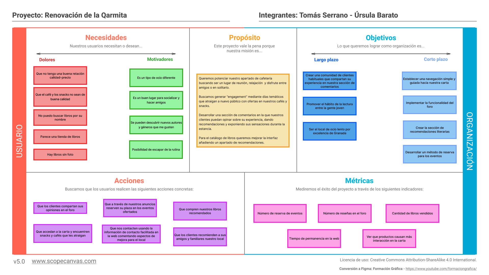

### 2.b User Flow (task) analysis 
 
-----

Hemos definido las tareas más importantes de nuestra funcionalidad en una tabla en la que según el perfil de la persona que use la página tendrán un uso o acceso diferente.
Hemos diferenciado entre usuario registrado, no registrado y el administrador que se encargará de tener la página actualizada

**Task Analysis**

| Acción | Usuario no registrado | Usuario registrado | Administrador |
| :--- | :--- | :--- | :--- |
| **Navegar por la página de inicio** | Alta | Alta | Alta |
| **Ver la carta (Cafetería)** | Alta | Alta | Baja |
| **Ver catálogo / Seleccionar un libro** | Alta | Alta | Baja |
| **Añadir libro al carrito** | Media | Alta | - |
| **Ir al carrito / Proceder al pago** | - | Alta | - |
| **Ver calendario de eventos** | Alta | Alta | Baja |
| **Mirar información de un evento** | Alta | Alta | Baja |
| **Iniciar sesión / Registrarse** | Alta | - | Alta |
| **Cerrar sesión** | - | Alta | Alta |
| **Reservar evento / Confirmar reserva** | - | Alta | - |
| **Cancelar acción (compra / reserva)** | Media | Media | - |
| **Añadir/Editar libros del catálogo** | - | - | Alta |
| **Actualizar carta de la cafetería** | - | - | Alta |
| **Crear/Gestionar eventos** | - | - | Alta |

**Userflow**

Para representar como será la navegación en nuestro sistema hemos diseñado un userflow con las tareas más significativas:

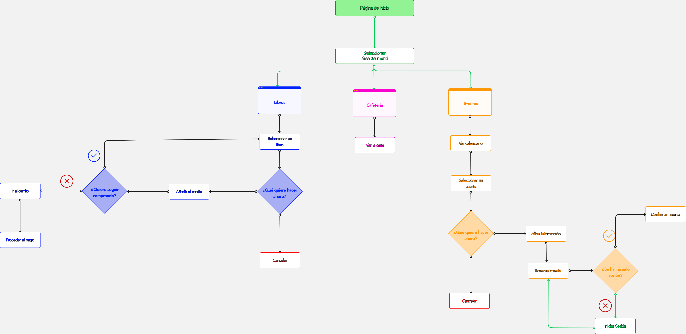

### 2.c IA: Sitemap + Labelling 
 

A continuación, presentamos nuestro *Sitemap* para ver como será la navegación y la tabla de *Labelling*

**Sitemap**

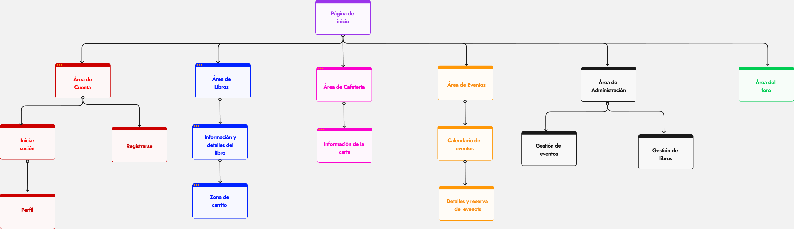

**Labelling**

| Término | Significado |
| :--- | :--- |
| **Página de Inicio** | Punto de entrada a la web que presenta las diferentes áreas de La Qarmita (Libros, Cafetería, Eventos y Foro). |
| **Área de Cuenta** | Sección general dedicada al acceso y registro de los clientes. |
| **Iniciar sesión** | Acceso de usuarios ya registrados a su cuenta privada mediante sus credenciales. |
| **Registrarse** | Opción para crear una nueva cuenta y formar parte de la comunidad de La Qarmita. |
| **Perfil** | Área privada donde el usuario puede ver y gestionar sus datos personales, compras y reservas. |
| **Área de Libros** | Sección de catálogo y tienda online para explorar la oferta literaria. |
| **Información y detalles del libro** | Página específica que muestra la sinopsis, autor, precio y disponibilidad de una obra. |
| **Añadir al carrito** | Acción que permite al usuario guardar temporalmente un libro para su compra. |
| **Zona de carrito / Ir al carrito** | Espacio donde el usuario revisa los libros seleccionados antes de formalizar el pedido. |
| **Proceder al pago** | Proceso de *checkout* final para confirmar y abonar los artículos del carrito. |
| **Área de Cafetería** | Sección dedicada a mostrar la propuesta gastronómica del local físico. |
| **Información de la carta / Ver la carta** | Visualización detallada del menú, incluyendo ingredientes, precios y alérgenos. |
| **Área de Eventos** | Sección que recoge la agenda cultural y social de La Qarmita. |
| **Calendario de eventos** | Vista estructurada cronológicamente para facilitar la búsqueda de próximas actividades. |
| **Detalles y reserva de eventos** | Página de información específica de una actividad (club de lectura, presentación, etc.) con la opción de inscribirse. |
| **Confirmar reserva** | Acción final para asegurar la plaza en un evento (requiere haber iniciado sesión). |
| **Área del foro** | Espacio interactivo de comunidad donde los usuarios pueden debatir, compartir opiniones y recomendar lecturas. |
| **Área de Administración** | Espacio oculto y exclusivo para los gestores y dueños de la plataforma. |
| **Gestión de eventos** | Panel del administrador para crear, editar, cancelar o aprobar eventos en el calendario. |
| **Gestión de libros** | Panel del administrador para añadir nuevo stock, actualizar precios o retirar libros del catálogo. |

### 2.d Wireframes
 
-----

Para la conceptualización visual de **La Qarmita**, hemos desarrollado wireframes simplones centrados en resolver los puntos de fricción detectados durante nuestra investigación (User Journey). El diseño mantiene una estructura de navegación coherente en la cabecera y un pie de página (footer) constante. 

> **Nota de diseño:** En todas las pantallas, el enlace *"Dónde encontrarnos"* del footer redirige directamente a **Google Maps** con la ubicación exacta del local, reduciendo la fricción para los usuarios que desean planificar su visita física.

 

#### 1. Página Principal
Actúa como nuestro escaparate digital. Su objetivo es superar la "Regla de los 5 segundos", mostrando de un vistazo el concepto híbrido del negocio (café + cultura). Incluye llamadas a la acción rápidas hacia las promociones gastronómicas y las lecturas recomendadas.

  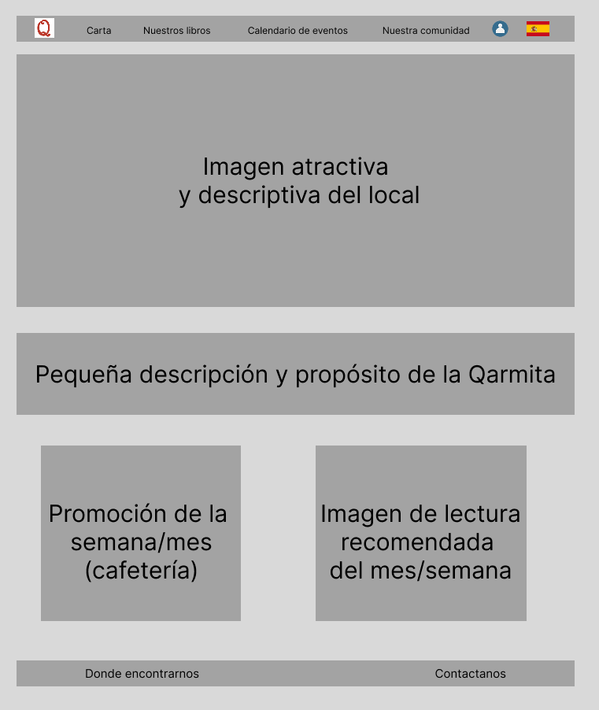

#### 2. Área de Cafetería (Carta)
Eliminamos la barrera del menú en PDF. Ahora la carta está integrada en la web, dividida por categorías visuales (Especialidades, Cafés, Snacks) con imágenes descriptivas, nombres y precios, facilitando el escaneo rápido y la legibilidad.

  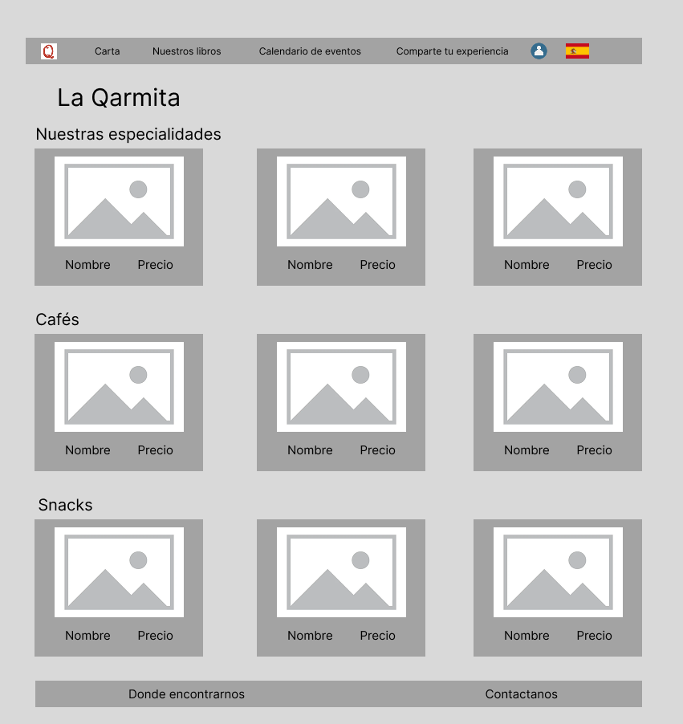

#### 3. Área de Libros
La tienda online. Hemos incorporado una **barra de búsqueda y sistema de filtros**, resolviendo directamente la frustración detectada en usuarios metódicos (como nuestra *Persona* Francisco). El catálogo se organiza de forma amigable mediante recomendaciones, novedades y favoritos.

  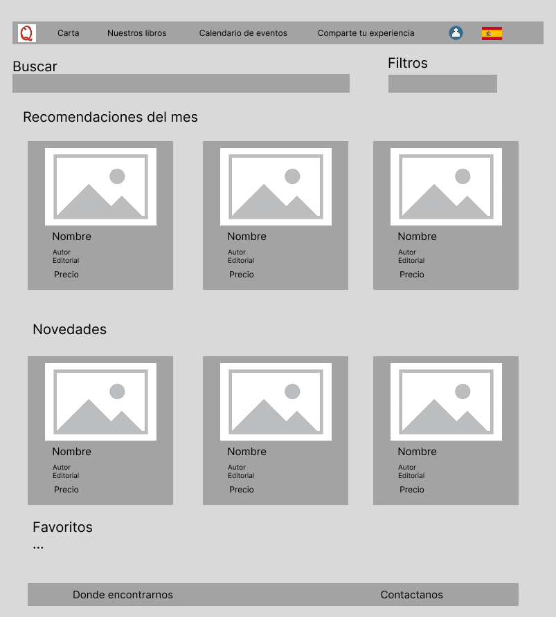

#### 4. Área de Eventos
Diseñada para potenciar la comunidad y el "ocio lento". Destaca el evento más próximo en la cabecera y ofrece un gran calendario interactivo. Al seleccionar un evento, el usuario accede a la información detallada y a la opción de reserva, solucionando la falta de digitalización de este servicio.

  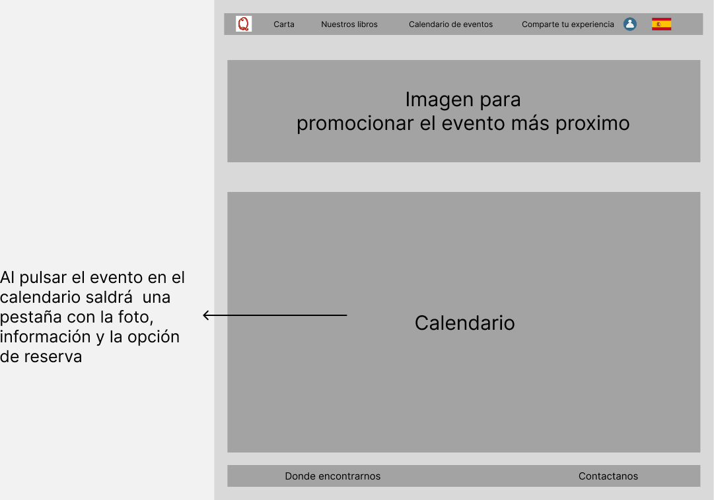

#### 5. Área de Foro (Comparte tu experiencia)
Accesible desde la barra de navegación principal, este espacio es el corazón de la comunidad online. Permite a los usuarios añadir comentarios, dejar valoraciones y leer las reseñas de otros clientes, trasladando el ambiente acogedor del local al entorno digital.

  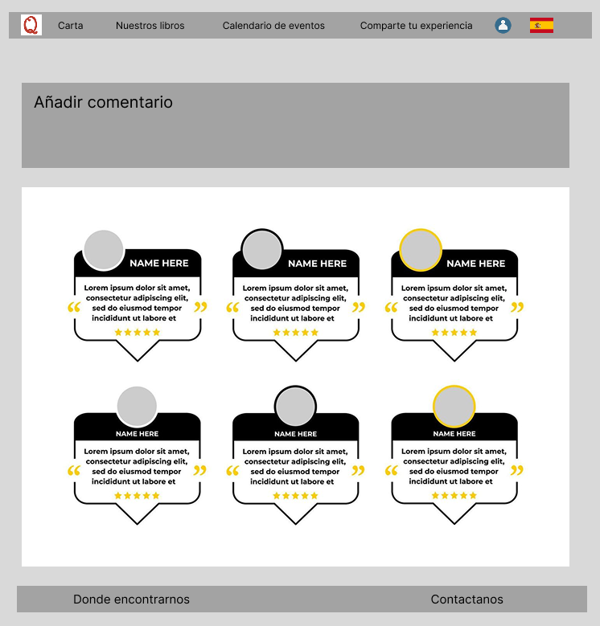

 

## Paso 3. Mi UX-Case Study (diseño)

>>> Cualquier título puede ser adaptado. Recuerda borrar estos comentarios del template en tu documento

### 3.a Moodboard

-----

### 3.b Landing Page
 
----

Nosotros primeramente hicimos un diseño que no era responsive y con algunos fallos de legibilidad, cuyo resultado es el siguiente:

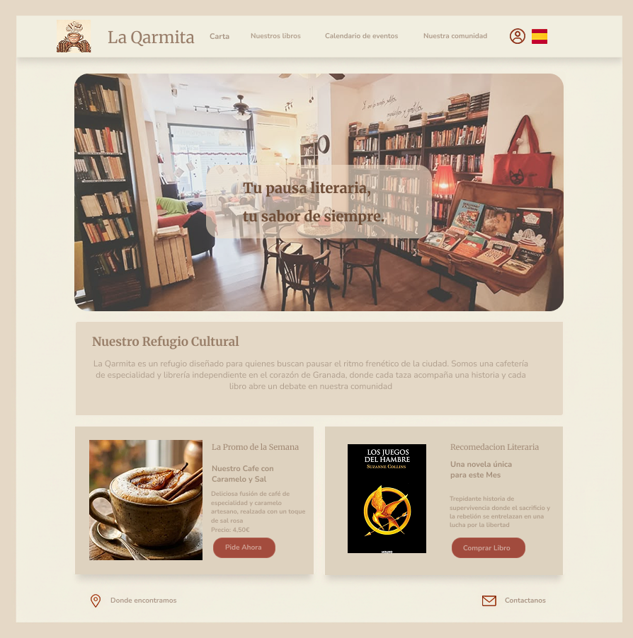

A continuación tenemos una versión remodelada con componentes responsive (*Auto Layout*) y la paleta arreglada para garantizar el contraste y la legibilidad:

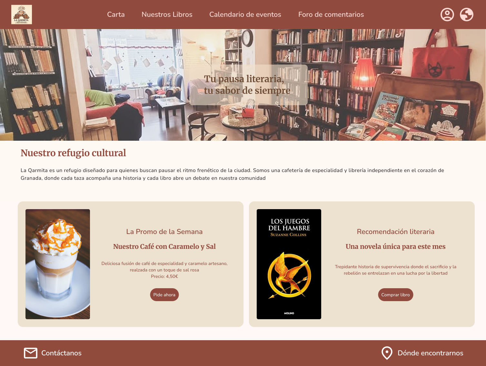

Ver el resultado en Figma [aqui](https://www.figma.com/design/JIRIAuXhJ4yCVDZBU1xFgJ/Frameworks?node-id=0-1&p=f&t=wgcLTUzpyuy64X87-0).

### 3.c Guidelines
 
----

Para el desarrollo del prototipo Hi-Fi de **La Qarmita** (versión escritorio), hemos aplicado la metodología **Atomic Design** y los principios fundamentales de **Material Design 3** para construir un sistema de diseño coherente, escalable y accesible.

**Herramientas y Recursos base**
* **Material Theme Builder:** Hemos utilizado este plugin para generar nuestra paleta tonal a partir de los colores del *moodboard*, garantizando matemáticamente un contraste óptimo entre fondos y textos para cumplir con los estándares de accesibilidad visual.
* **Material Symbols:** Empleado para integrar iconografía estandarizada y reconocible (perfil, idioma, ubicación, correo, estrellas de valoración).
* **Figma Community & Plugins:** Integración de componentes base adaptados (como *Review Cards* o Calendarios) y uso de plugins como *UI Faces* / *Unsplash* para dotar de realismo a los avatares de los usuarios.

**Paleta de Colores (Accesibilidad y Contraste)**
Se han corregido los problemas de legibilidad del diseño inicial asignando roles estrictos a cada color:
* **Background / Surface (Tonos Crema - `#F2E0C9`, `#E4D8C6`):** Utilizados como lienzo principal y fondo de las tarjetas para transmitir calidez y la sensación de "ocio lento".
* **On Background / On Surface (Marrón Oscuro - `#592D23`):** Aplicado a todos los textos e iconos para asegurar una lectura perfecta y sin fatiga visual sobre los fondos claros.
* **Primary (Burdeos - `#A34C3D`):** Reservado exclusivamente para botones, llamadas a la acción (Call to Action) y acentos visuales. El texto en su interior utiliza el token `On Primary` (crema claro) para maximizar el contraste.

**Tipografía**
* **Merriweather (Serif):** Utilizada en títulos y encabezados (`H1`, `H2`) para reforzar la identidad clásica y literaria de la librería.
* **Nunito (Sans-Serif):** Empleada en los cuerpos de texto, comentarios del foro y menús de navegación, aportando limpieza y legibilidad en entornos digitales.

**Patrones UI Aplicados (UI Patterns) y Comportamiento**
Todo el diseño se ha estructurado utilizando *Auto Layout* en Figma para asegurar un comportamiento *responsive* fluido en pantallas de escritorio.

* **Top App Bar (Header) & Fat Footer:** Elementos de navegación persistentes. El Header agrupa logotipo, menú principal y acciones rápidas. El Footer, con alto contraste, cierra la estructura visual y proporciona enlaces de utilidad.
* **Hero Image con Overlay:** Imagen de cabecera a pantalla completa con un contenedor semitransparente (`Primary Container`) que asegura la legibilidad del texto sobre fondos fotográficos.
* **Grid Responsivo (Wrap):** Uso avanzado de la función *Wrap* de Auto Layout en los catálogos y el foro para crear cuadrículas (Grids) de tarjetas que saltan de línea y se adaptan automáticamente al ancho disponible de la pantalla.
* **Búsqueda y Filtros:** Implementación de barras de búsqueda combinadas con "Chips" (etiquetas) para facilitar la exploración y el filtrado en la vista del catálogo de libros.
* **Formularios y Reseñas (Testimonials):** Cajas de comentarios (Inputs) diseñadas con estados simulados mediante *Variantes* (para mostrar el estado de escritura/clic) y tarjetas de opinión que estructuran avatares, valoraciones y testimonios.
* **Microinteracciones:** Uso de *Smart Animate* para crear transiciones suaves, destacando los estados *Hover* en las tarjetas de reseña mediante un aumento de la sombra paralela (elevación) para dar feedback visual de interactividad al usuario.

### 3.d Mockup
 
----

A continuación se presentan las vistas principales del prototipo de Alta Fidelidad (Hi-Fi) desarrolladas para La Qarmita, aplicando el sistema de diseño previamente documentado.

#### 1. Landing Page (Inicio)
 <!-- Reemplaza con la ruta real de tu imagen -->

#### 2. Nuestros Libros (Catálogo y Búsqueda)
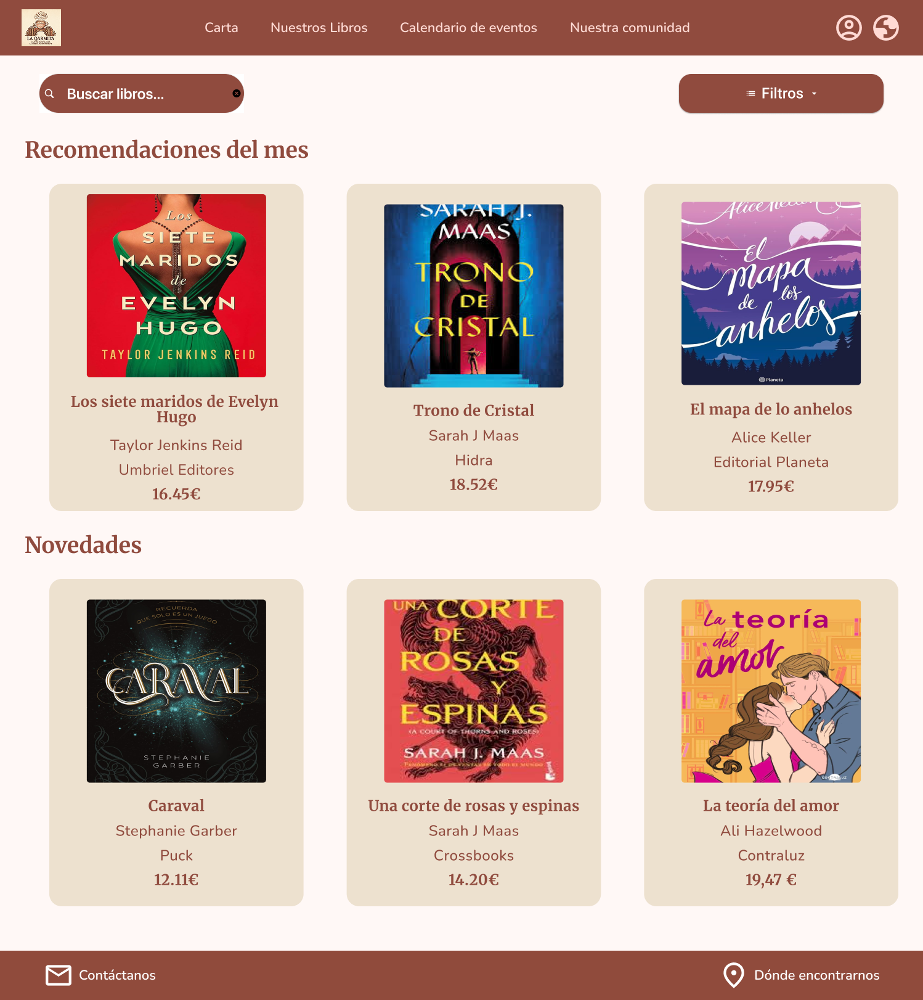 <!-- Reemplaza con la ruta real de tu imagen -->

#### 3. Eventos (Calendario)
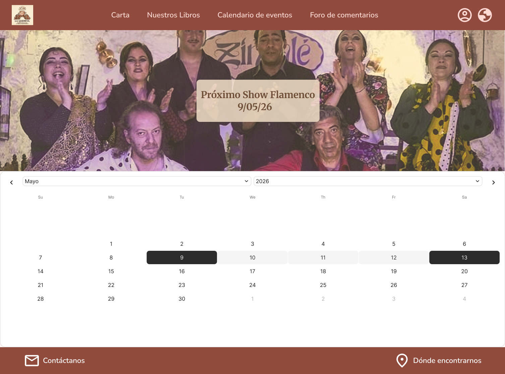 <!-- Reemplaza con la ruta real de tu imagen -->

#### 4. Foro (Comunidad y Reseñas)
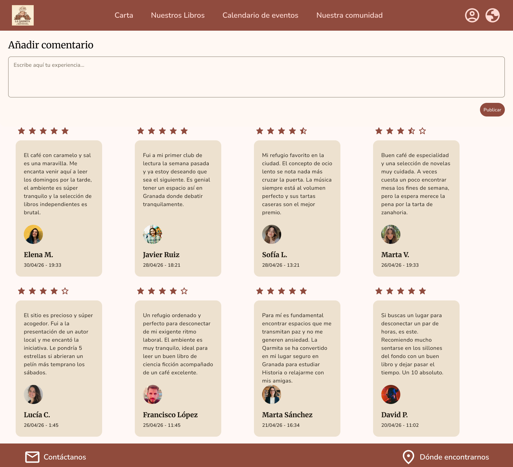 <!-- Reemplaza con la ruta real de tu imagen -->

 

**🔗 Enlace al Prototipo Interactivo:**
Puedes navegar por la versión interactiva y probar las animaciones, estados *hover* y la navegación entre pantallas directamente en Figma a través del siguiente enlace:

👉 [Haz clic aquí para abrir el Prototipo en Figma](https://www.figma.com/proto/JIRIAuXhJ4yCVDZBU1xFgJ/Frameworks?node-id=19-135&t=hd6Yt14wQIuHIHz9-0&scaling=min-zoom&content-scaling=fixed&page-id=0%3A1&starting-point-node-id=19%3A135)

 

## Paso 4. Exportación y Documentación 

### 4.a Exportación a HTML/React
 
----

El objetivo de esta fase ha sido transformar los diseños visuales y prototipos elaborados en Figma a un proyecto web funcional construido con **React (Vite, JavaScript y CSS Modules)**.

Para llevar a cabo esta tarea, hemos definido un flujo de trabajo iterativo asistido por Inteligencia Artificial, priorizando la escalabilidad y las buenas prácticas de desarrollo:

1. **Exportación inicial con Locofy:** Se utilizó el plugin *Locofy Lightning* en Figma para generar una primera base de código React a partir de los diseños.
2. **Refactorización con IA Generativa (Gemini):** Dado que las herramientas automáticas (diseño a código) suelen generar código monolítico, redundante y poco semántico, se utilizó IA Generativa asumiendo el rol de un Desarrollador Senior para realizar una refactorización profunda.
3. **Aplicación de Diseño Atómico (Atomic Design):** El código crudo de Locofy se desensambló y reconstruyó siguiendo una arquitectura estricta de Diseño Atómico. Se crearon Átomos (`PrimaryButton`), Moléculas (`BookCard`, `PromoCard`), Organismos (`Header`, `BookGrid`) y Páginas.
4. **Mejoras UX/UI en código:** Se eliminaron las posiciones absolutas de Figma, transformando los layouts en estructuras fluidas y 100% responsivas mediante *CSS Grid* y *Flexbox*, además de añadir interactividad con estado de React (`useState`).

>>> **Nota sobre la ubicación del código:** Todo el código fuente de la aplicación React generada en este paso se encuentra alojado en el directorio `P4/app/` de este repositorio.

#### Resultado Visual de las Páginas Ensambladas

*(Añade a continuación las capturas de pantalla de tu aplicación corriendo en el navegador)*

  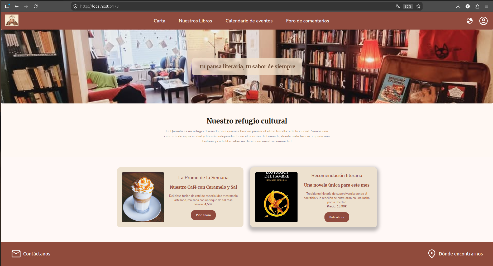
   
  <i>Página principal: Escritorio (Landing Page)</i>

 

  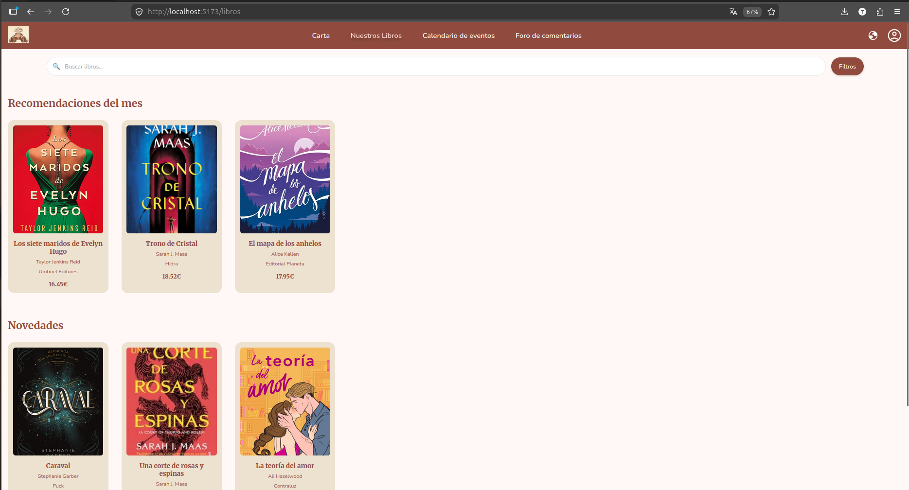
   
  <i>Página del catálogo: Nuestros Libros</i>

 

  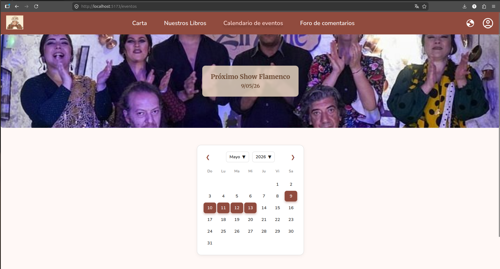
   
  <i>Página de la comunidad: Calendario de Eventos</i>

 

  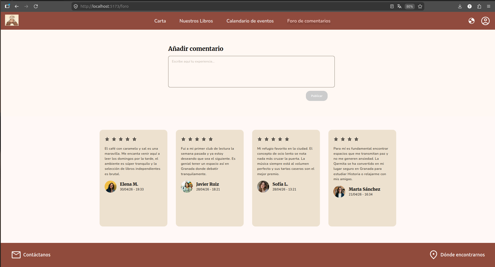
   
  <i>Página interactiva: Foro de Comentarios</i>

 

### 4.b Documentación con Storybook

----

Dado que hemos construido nuestra interfaz basándonos en la metodología de **Diseño Atómico**, la documentación visual de los componentes resultaría el paso lógico y fundamental para asegurar el mantenimiento del sistema de diseño (Design System).

La herramienta estándar en la industria para este propósito es **Storybook**. El procedimiento teórico planificado para su implementación consistía en:
1. Inicializar el entorno de Storybook dentro de nuestro proyecto Vite/React en la carpeta `P4/app/`.
2. Crear historias (`.stories.jsx`) para documentar visualmente nuestros componentes "puros" (Átomos y Moléculas), aislándolos de la lógica de negocio de las páginas.
3. Documentar las diferentes *props* y estados de cada componente (por ejemplo, el estado por defecto y el estado deshabilitado de un `PrimaryButton`, o las variantes con y sin sombra de una `PromoCard`).

**Justificación de no implementación:**
A pesar de tener los componentes refactorizados y preparados para ser integrados en este entorno, **debido a limitaciones de tiempo y a los ajustes en la programación temporal de la asignatura**, se ha acordado prescindir de la implementación técnica de Storybook en esta entrega. El esfuerzo se ha concentrado íntegramente en asegurar la calidad, modularidad y semántica del código React alojado en `P4/app/`.

 

## Paso 5. Pruebas de Evaluación 

### 5.a Reclutamiento de usuarios 

-----

El caso B corresponde a la propuesta de rediseño web del equipo **Errores404** para **La Qarmita**. Su objetivo principal es solucionar la fragmentación digital actual del local (que divide su contenido entre un blog antiguo y una web limitada) y transformarlo en un verdadero hub cultural digital. 

A diferencia de nuestra propuesta (Caso A), el Caso B pone un fuerte énfasis en la implementación de un **sistema de reservas integrado, e-commerce para café/libros y un sistema de fidelización por recompensas** para atraer a su público objetivo (estudiantes, amantes del arte y creadores). Su diseño visual opta por un enfoque de "galería" minimalista y editorial.

#### Usuarios de muestra para tests (Muestra representativa)

Se reclutarán 10 participantes en total (5 por caso), segmentados según los motivadores del ScopeCanvas:

| Usuarios | Sexo/Edad | Ocupación | Exp.TIC | Personalidad | Plataforma | Caso | Posibles situaciones conflictivas |
| U1 - Julieta | M/20 | Estudiante | Baja | Introvertida | ordenador | A | Puede saltarsse pasos o no fijarse en los detalles. |
| U2 - Estefania | M/21 | Estudiante | Alta | Extrovertida | ordenador | B | Puede cansarse si ve demasiado texto. |
| U3 - Alejandro | H/20 | Estudiante | Alta | Racional | ordenador | A | Puede rechazar el sistema si los pasos no siguen un orden lógico. |
| U4 - Juan Atonio | H/71 | Jubilado | Baja | Racional | ordenador | B | Puede perderse si la interfaz está muy sobrecargada. |
| U5 - Yolanda | M/61 | Psicóloga | Baja | Extrovertida | ordenador | A | Puede distraerse en interfaces demasiado complejas. |
| U6 - Paula | M/21 | Estudiante | Baja | Extrovertida | ordenador | B | Puede abandonar la página web si el proceso es monótono. |
| U7 - Jose Antonio | H/20 | Estudiante | Baja | Introvertida | ordenador | A | Puede confundirse si no hay indicaciones claras. |
| U8 - Jose Luis| H/21 | Estudiante | Alta | Racional | ordenador | B | Puede frustrarse si el sistema es lento o ineficiente. |
| U9 - Lucas | H/21 | Estudiante | Alta | Extrovertida | ordenador | A | Se impacienta si el flujo es largo o poco claro. |
| U10 - Ruth | M/23 | Estudiante | Alta | Extrovertida | ordenador | B | Puede abandonar la web si no le resulta atrayente. |

### 5.b Diseño de las pruebas 
 
-----

Las pruebas se desarrollarán de forma remota utilizando **Maze** (métricas de navegación y tareas) y **GazeMapping** (Eye Tracking), basándonos en las acciones clave definidas las propuestas de ambos proyectos. En ambos casos estudiaremos dos páginas interesantes de cada proyecto.

#### 1. A/B Testing (Maze)
Se diseñarán tareas equivalentes en Maze para medir:
- Facilidad para navegar por la página.
- Tasa de éxito por las tareas propuestas.
- Satisfacción general y comentarips cualitativos.

#### 2. Test SUS (System Usability Scale)
Cuestionario estándar de 10 preguntas al finalizar para comparar la usabilidad percibida entre la estructura cálida/bloques (Caso A) y la estructura editorial/minimalista (Caso B).

#### 3. Eye Tracking (Gaze Recorder)
Prueba de exploración libre (20 segundos) seguida de tareas dirigidas. Mediremos mapas de calor (Heatmaps) y rutas de mirada para analizar cómo interactúan con el entorno propuesto por cada grupo.

### 5.c A/B Testing
 
-----

#### Test A – La Qarmita (Nuestra propuesta)

**Landing Page** y **Foro de Comentarios**

**Tareas:**
1. Localizar e identificar cómo podríamos iniciar sesión en la web o cambiar el idioma.
2. Explorar el menú para conocer la información de la promoción de comida o recomendación literaria.
3. Dejar o buscar una reseña en el foro/comunidad.
4. Ver fácilmente quién tiene mejor o peor opinión del lugar.

### Feedback recogido:

  * Opinión general media: 4.6 / 7 

  * Facilidad notable para identificar la jerarquía visual de las promociones y reseñas, aunque los usuarios con menos experiencia (U1, U7) dudaron ante la iconografía del encabezado.

  * Valoración estética alta gracias al uso de imágenes reales que generan confianza y una estructura muy limpia.
-----

#### Test B – Proyecto Errores404 (Propuesta Alternativa)

**Landing Page** y **Agenda**

**Tareas (Basadas en su Visión ):**
1. Indagar en las comunidades que atrae el negocio.
2. Comprar o buscar información sobre novedades del café de especialidad en grano.
3. Localizar la información sobre los eventos.
4. Uso de herramientas (filtros, busqueda...) para ver eventos de manera detallada.
5. Encontrar la vía de contacto para proponer una exposición de arte y encontrarlos en redes sociales.

### Feedback recogido:

  * Opinión general media: 4.8 / 7 

  * Alta eficiencia en la búsqueda de eventos gracias a los filtros avanzados, aunque los usuarios más racionales (U8) demandaron una carga de datos aún más rápida.

  * Diseño valorado como "profesional y moderno", aunque usuarios de mayor edad (U4) percibieron cierta saturación de información en las secciones de texto denso.

### Preguntas

| | Preguntas | U1 | U2 | U3 | U4 | U5 | U6 | U7 | U8 | U9 | U10 |
| 1 | ¿Cómo calificarías tu experiencia general usando esta app? | 6 | 5 | 5 | 5 | 4 | 4 | 3 | 6 | 5 | 5 |
| 2 | ¿Encontraste lo que buscabas fácilmente? | 5 | 5 | 4 | 4 | 3 | 5 | 2 | 5 | 4 | 4 |
| 3 | ¿Recomendarías esta app a otras personas? | 5 | 4 | 5 | 3 | 4 | 3 | 3 | 4 | 5 | 4 |
| 4 | ¿La aplicación te resultó atractiva visualmente? | 6 | 4 | 4 | 5 | 5 | 6 | 4 | 5 | 5 | 6 |

### Conclusión del A/B Testing

A partir de los resultados obtenidos, podemos concluir que ambos casos presentan fortalezas distintas según el perfil del usuario. Sin embargo, el Caso A (La Qarmita) destaca por una curva de aprendizaje más suave para usuarios con experiencia TIC baja, gracias a su interfaz basada en bloques visuales claros y un foro intuitivo.

Por otro lado, el Caso B (Errores404) resultó ser más robusto para usuarios que buscan funcionalidades avanzadas (filtros, agenda detallada y segmentación por comunidades), obteniendo una media de satisfacción general ligeramente más consistente entre los perfiles técnicos.

En resumen, mientras que el Caso A es superior en conexión emocional y simplicidad, el Caso B ofrece una herramienta de gestión de eventos más potente. 

### 5.d Cuestionario SUS 

### Usuarios Test A 
| | Preguntas | U1 | U3 | U5 | U7 | U9 |
| 1 | Creo que me gustará visitar con frecuencia este website | 4 | 5 | 3 | 3 | 4 |
| 2 | Encontré el website innecesariamente complejo | 2 | 1 | 3 | 3 | 1 |
| 3 | Pensé que era fácil utilizar este website | 4 | 5 | 3 | 4 | 5 |
| 4 | Creo que necesitaría del apoyo de un experto para recorrer el website | 2 | 1 | 2 | 1 | 1 |
| 5 | Encontré las funciones del website bastante bien integradas | 4 | 5 | 4 | 3 | 5 |
| 6 | Pensé que había demasiada inconsistencia en el website | 2 | 2 | 2 | 3 | 1 |
| 7 | Imagino que la mayoría de las personas aprenderían muy rápidamente a utilizar el website | 4 | 5 | 4 | 3 | 4 |
| 8 | Encontré el website muy grande al recorrerlo | 2 | 1 | 3 | 3 | 1 |
| 9 | Me sentí muy confiado en el manejo del website | 3 | 5 | 3 | 3 | 5 |
| 10 | Necesito aprender muchas cosas antes de manejarse en el website | 2 | 1 | 3 | 3 | 1 |

### Usuarios Test B
| | Preguntas | U2 | U4 | U6 | U8 | U10 |
| 1 | Creo que me gustará visitar con frecuencia este website | 4 | 4 | 5 | 5 | 4 |
| 2 | Encontré el website innecesariamente complejo | 2 | 3 | 2 | 1 | 2 |
| 3 | Pensé que era fácil utilizar este website | 4 | 2 | 4 | 5 | 4 |
| 4 | Creo que necesitaría del apoyo de un experto para recorrer el website | 2 | 2 | 2 | 1 | 2 |
| 5 | Encontré las funciones del website bastante bien integradas | 5 | 3 | 4 | 5 | 4 |
| 6 | Pensé que había demasiada inconsistencia en el website | 2 | 2 | 2 | 1 | 2 |
| 7 | Imagino que la mayoría de las personas aprenderían muy rápidamente a utilizar el website | 4 | 3 | 5 | 5 | 4 |
| 8 | Encontré el website muy grande al recorrerlo | 2 | 4 | 3 | 2 | 3 |
| 9 | Me sentí muy confiado en el manejo del website | 4 | 2 | 4 | 5 | 4 |
| 10 | Necesito aprender muchas cosas antes de manejarse en el website | 1 | 3 | 2 | 1 | 2 |

### Resultados
A partir de las respuestas
| Usuario | Caso | Punutación SUS |
| U1 | A | 72.5 |
| U2 | B | 75.0 |
| U3 | A | 97.5 |
| U4 | B | 50.0 |
| U5 | A | 60.0 |
| U6 | B | 77.5 |
| U7 | A | 57.5 |
| U8 | B | 97.5 |
| U9 | A | 95.0 |
| U10 | B | 72.5 |

**Promedio por caso:**

  * Caso A (La Qarmita): 76,50
  * Caso B (Errores404): 74,50

Según la escala de referencia del SUS:

  * El Caso A (La Qarmita) obtuvo una media de 76,50, lo que se interpreta como una experiencia buena. La puntuación se mantiene sólida gracias a la facilidad de uso percibida por los perfiles más técnicos, aunque usuarios como U7 bajaron ligeramente el promedio al encontrar ciertas barreras en tareas específicas.

  * El Caso B (Errores404) obtuvo una media de 74,50, que entra en la categoría de buena. Existe una competencia muy directa con el caso A, aunque la complejidad del sistema de filtros y la densidad de información en la agenda siguen penalizando la puntuación en usuarios con menor competencia digital (U4).

**Valoración personal**

Aunque los resultados del cuestionario SUS reflejan una valoración más alta para el Caso A (La Qarmita), mi percepción personal es algo más matizada. Es cierto que el Caso A ofrece una experiencia más clara a nivel visual y una navegación inicial más sencilla. Su diseño es limpio, estéticamente cuidado y transmite bien su identidad desde la pantalla de inicio. Esa coherencia visual ha influido positivamente en la valoración de los usuarios, especialmente en los perfiles que buscan una interacción rápida y emocional.

Por otro lado, el Caso B (Errores404) es un prototipo más desarrollado en cuanto a contenido y funcionalidad técnica. Incluye secciones más complejas como la agenda con filtros avanzados y una estructura de comunidades más profunda. Esto introduce una mayor carga cognitiva inicial, lo que explica por qué algunos usuarios otorgan puntuaciones más desiguales. Sin embargo, para un uso recurrente, esta propuesta ofrece herramientas mucho más potentes para el usuario.

En resumen, mientras que el Caso A destaca por su claridad visual y diseño estético, el Caso B presenta una solución más completa y funcional. Ambos prototipos tienen puntos fuertes, y el hecho de que sus promedios estén tan cercanos (76,50 vs 74,50) evidencia que la decisión final dependerá de si se prioriza la sencillez inmediata o la profundidad de herramientas.

## 5.e Aplicación del método Eye Tracking 
### Caso B 
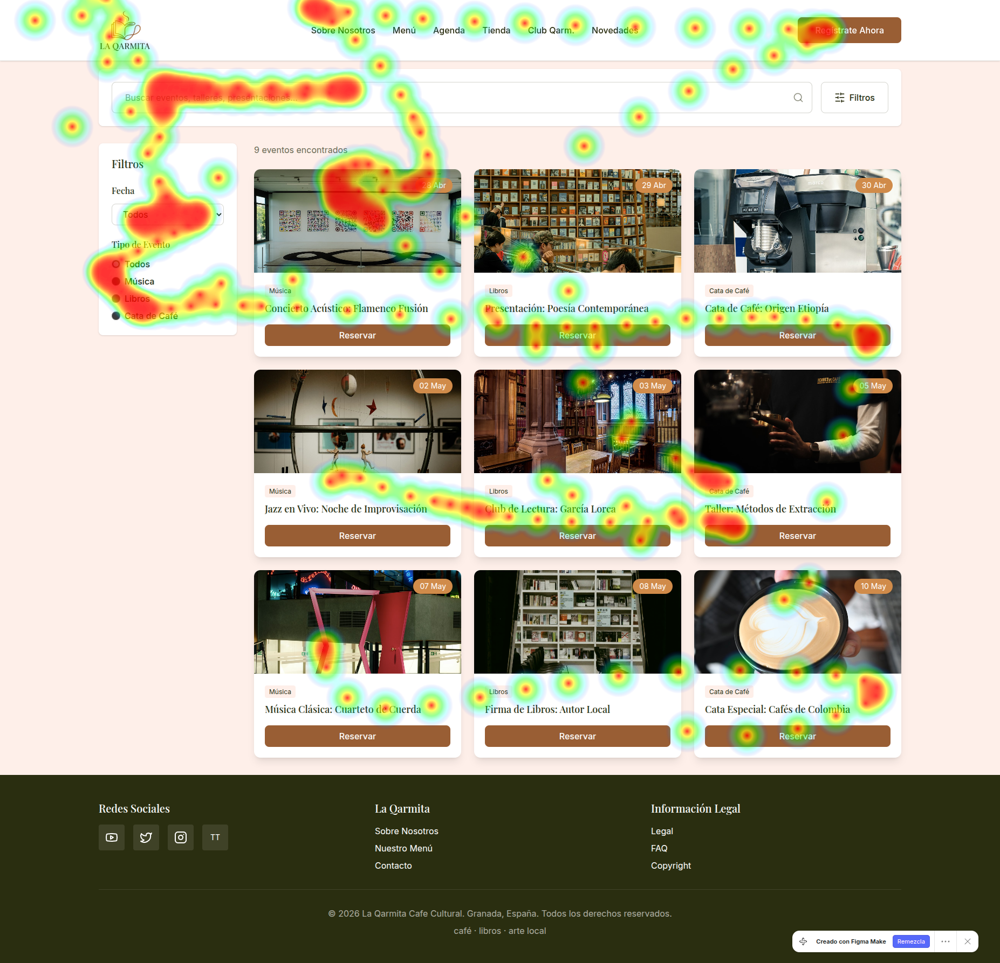

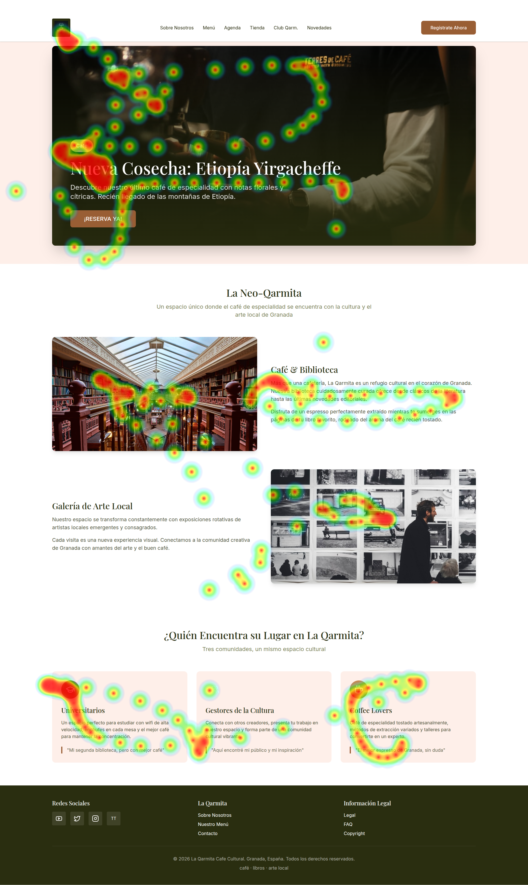

A partir de los mapas de calor (Heatmaps) analizados para el Caso B (Agenda y Landing Page), se han extraído las siguientes conclusiones sobre el comportamiento visual de los usuarios:
Observaciones principales

  * En la pantalla de Agenda, se observa una mancha de calor muy intensa en la barra de búsqueda y el panel de filtros lateral. Esto indica que los usuarios identifican rápidamente estas herramientas para segmentar el contenido.

  * Las imágenes de los eventos (especialmente la del primer concierto y la cata de café final) y el "Hero" de la landing page atrajeron gran parte de la atención. Los usuarios escanean las imágenes antes que el texto descriptivo.

  * Los botones de "Reservar" muestran una actividad térmica muy baja. Los usuarios miran la información del evento, pero su ojo no se posa de forma natural en la llamada a la acción (CTA).

  * El pie de página con redes sociales e información legal fue completamente ignorado por todos los usuarios.

En un diseño que busca la conversión (reservas o ventas), es crítico que los elementos de interacción sean los protagonistas visuales. Los mapas de calor revelan que, aunque la jerarquía informativa es buena para leer, es deficiente para actuar. Los usuarios procesan qué eventos hay, pero el diseño no los "empuja" visualmente a completar la reserva, ya que los botones marrones se mimetizan demasiado con el resto de la estética cromática del sitio.

Recomendaciones

  * Cambiar el color o aumentar el contraste de los botones "Reservar". Un tono que rompa con la paleta de marrones suaves ayudaría a sacarlos de la "ceguera" visual.

  * Los iconos de la sección "¿Quién encuentra su lugar...?" reciben atención, pero el texto inferior no. Se recomienda simplificar el texto o convertir los iconos en botones más obvios.

  * Simplificar el panel de filtros: Aunque se usa mucho, la mancha de calor es errática. Agrupar los filtros de forma más compacta evitaría que el usuario pierda tiempo escaneando el lateral y se centre en los resultados.

  * Aumentar el tamaño de las fechas en las cards: En la Agenda, los usuarios miran la imagen pero les cuesta fijar la vista en el pequeño recuadro de la fecha (ej. 28 Abr), lo que podría causar confusión en la planificación.

### Caso A
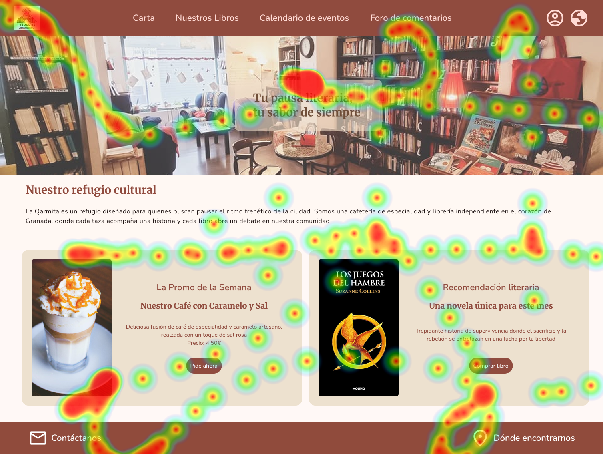

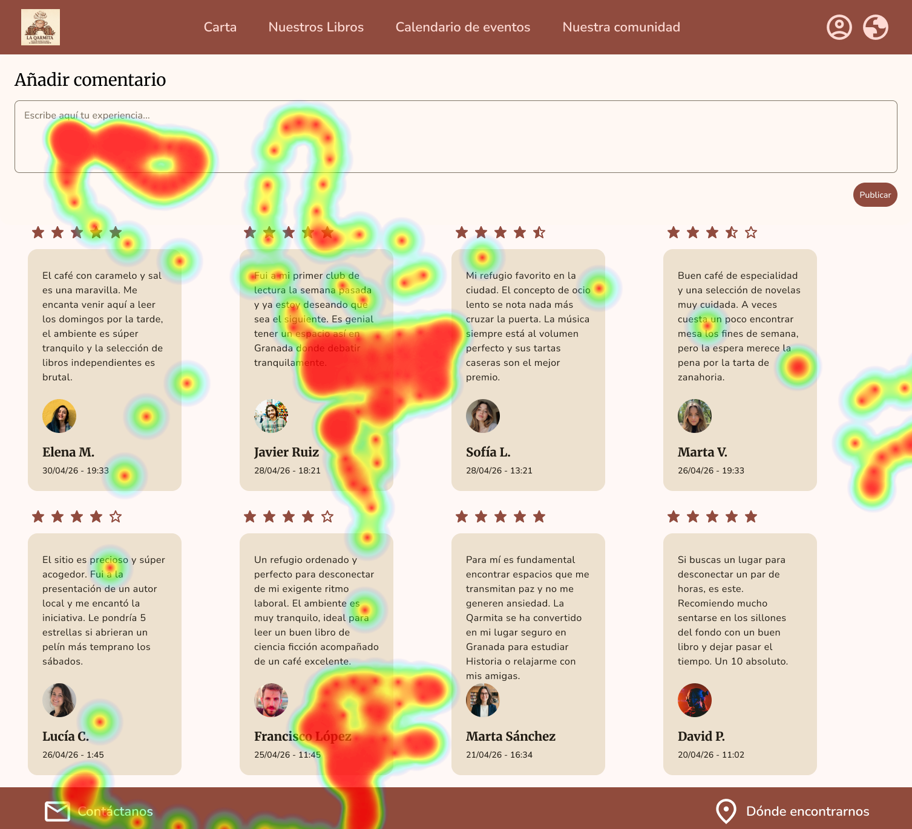

A partir del análisis de los mapas de calor para el Caso A , se extraen las siguientes observaciones sobre la jerarquía visual y la interacción en la Landing Page y el Foro:

  * Se observa una concentración de calor muy intensa en el mensaje central "Tu pausa literaria, tu sabor de siempre". Los usuarios procesan la propuesta de valor de inmediato antes de realizar scroll.

  * A diferencia del caso B, aquí las secciones de "La Promo de la Semana" y "Recomendación literaria" reciben una atención muy equitativa. Los usuarios escanean ambas tarjetas, lo que indica que el diseño de dos columnas funciona bien para diversificar el interés.

  * Los botones de "Pide ahora" y "Comprar libro" muestran manchas de calor moderadas. Aunque no son el foco principal, tienen mayor visibilidad relativa que en la propuesta B, posiblemente por estar rodeados de más espacio en blanco.

   * *En la pantalla de comentarios, se observa un patrón de lectura muy marcado en las reseñas centrales (Javier Ruiz y Francisco López). Los usuarios tienden a leer los bloques de texto completos, lo que valida la legibilidad de la tipografía elegida.

El diseño del Caso A logra una dirección de la mirada más natural y fluida. Los usuarios no se sienten abrumados por herramientas complejas (como filtros o buscadores densos), lo que permite que se concentren en el contenido editorial y las promociones. El mapa de calor del foro demuestra que la comunidad es un punto de gran interés, donde el usuario dedica tiempo real a procesar la información subjetiva de otros clientes.

**Observaciones principales**

El análisis de los mapas de calor muestra que la interfaz del Caso B, aunque presenta una carga visual más densa y un enfoque profesional, logra captar con éxito la atención del usuario en bloques informativos estratégicos como el buscador de eventos y los filtros laterales. El uso de imágenes de alta calidad y una jerarquía tipográfica moderna funciona correctamente para destacar el contenido de la agenda y las novedades de la cosecha. Sin embargo, resulta crítico observar la escasa atención que reciben los botones de “Reservar” y “Reserva ya”, los cuales, a pesar de ser los elementos clave para la conversión, pasan desapercibidos al mimetizarse con la paleta cromática. Algo similar ocurre con el selector de fecha, que no termina de proyectar la relevancia necesaria para la funcionalidad de la pantalla.

En contraste, el Caso A presenta una propuesta mucho más limpia y directa, centrando la mirada de forma casi inmediata en el eslogan principal y las tarjetas de promoción semanal. Su navegación es más intuitiva para el usuario medio al no presentar distracciones técnicas, aunque ofrece una menor profundidad visual y una interacción más limitada con herramientas avanzadas. En este caso, la lectura del foro demuestra que el diseño favorece la pausa y el consumo de contenido textual de manera fluida, aunque la parte inferior de la pantalla y los datos de contacto son sistemáticamente ignorados.

En conjunto, el Caso B ofrece una experiencia visual más rica, realista y cercana a una aplicación de mercado con una gran variedad de estímulos escaneados por el usuario. No obstante, el Caso A aventaja en claridad y dirección de la mirada, asegurando que los mensajes principales lleguen al usuario sin esfuerzo. Para optimizar la propuesta final, el Caso B necesita mejorar urgentemente la visibilidad de sus elementos de acción para que la alta atención visual que recibe su contenido se traduzca efectivamente en una interacción funcional y una mayor facilidad de uso.

## Conclusiones finales & Valoración de las prácticas

>>> Opinión FINAL del proceso de desarrollo de diseño siguiendo metodología UX y valoración (positiva /negativa) de los resultados obtenidos. ¿Qué se puede mejorar? Recuerda que este tipo de texto se debe eliminar del template que se os proporciona 

