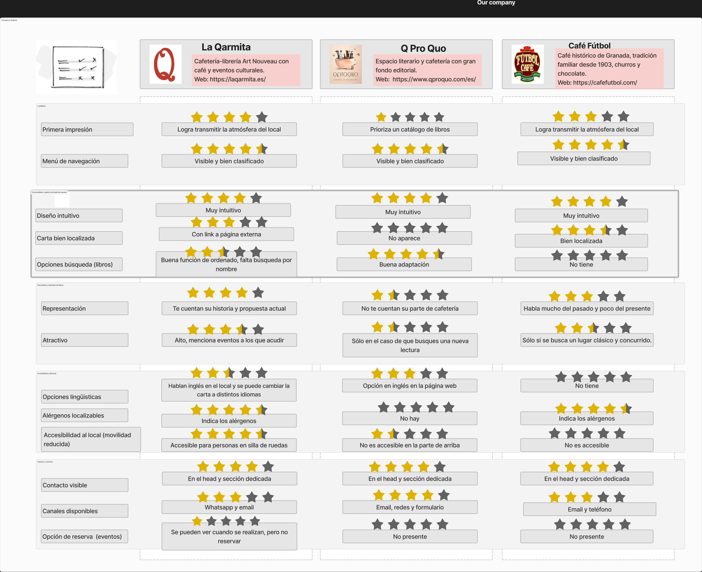
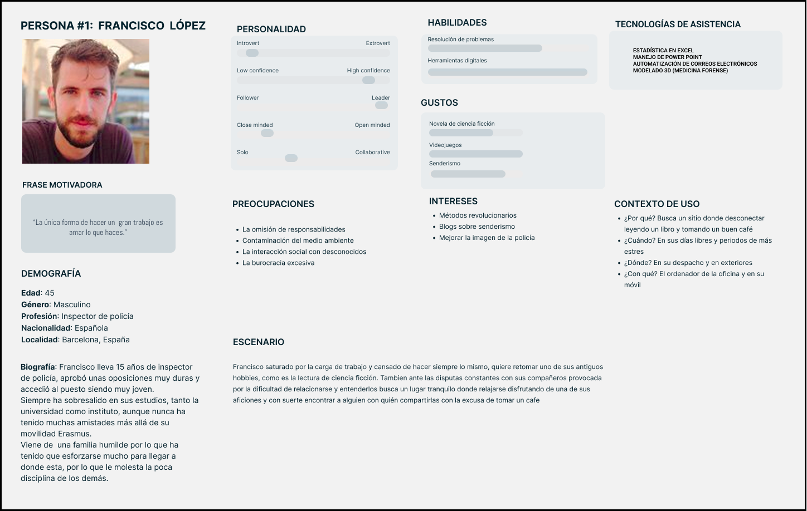
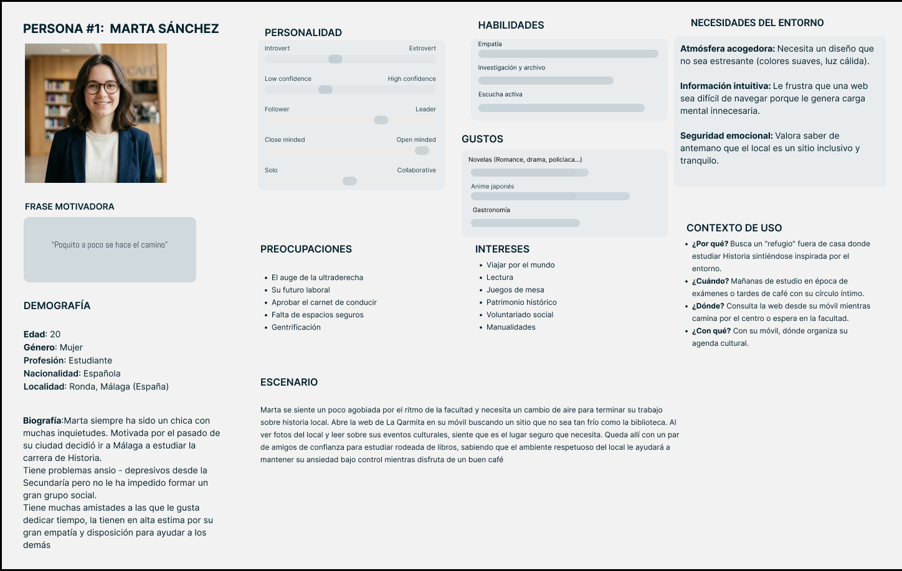
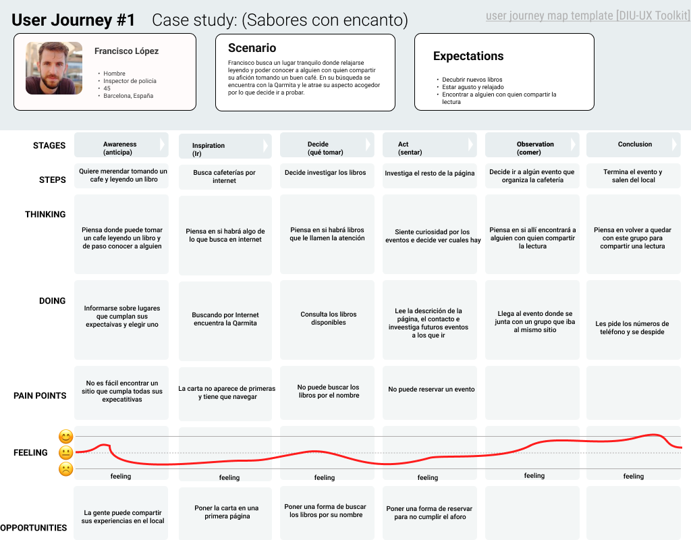
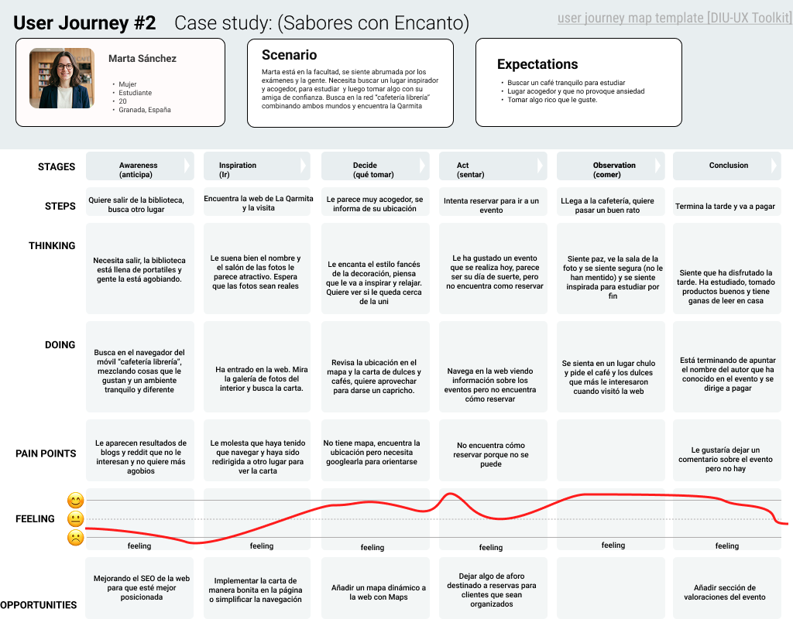
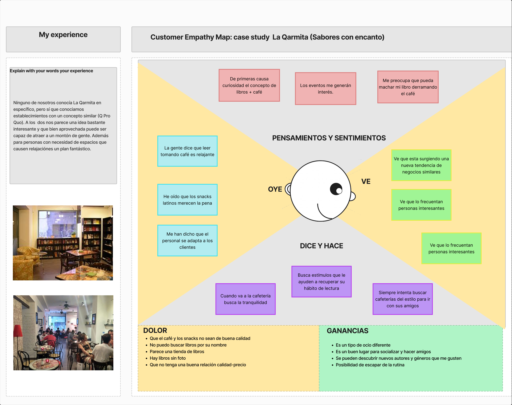

# DIU26
Prácticas Diseño Interfaces de Usuario (Tema: .... ) 

* [Guiones de prácticas](GuionesPracticas/)
* [Guía para crea tu Case Study](Guia_CaseStudy.md)
* Sala de la Fama [DIU Hall of fame](https://github.com/mgea/DIU/tree/master/hall_of_fame) donde se pueden encontrar Case Study destacados de otros años.

Actualizado: 14/01/2026

## Paso 0 My UX-Case Study
 
-----

>>> Este documento es el esqueleto del Case Study que explica el proceso de desarrollo de las 5 prácticas de DIU. Aparte de subir cada entrega a PRADO, se debe actualizar y dar formato de informe final a este documento online. Elimine este tipo de texto / comentarios desde la práctica 1 conforme proceda a cada paso

>>> Hay que Publicar de forma incremental "my Case Study" en Github... Es el momento de dejar este documento para que sea evaluado y calificado como parte de la práctica
>>> Documente bien la cabecera y asegurese que ha resumido los pasos realizados para el diseño de su producto

Grupo: DIU2_UrsMas.  Curso: 2025/26 

Nombre del Proyecto: 

>>> Decida el nombre corto de su propuesta en la práctica 2 

Descripción: 

>>> Describa la idea de su producto en la práctica 2 

Logotipo: 

>>> Si diseña un logotipo para su producto en la práctica 3 pongalo aqui, a un tamaño adecuado. Si diseña un slogan añadalo aquí

### UrsMas Team

**Integrantes:**

* **Tomás Serrano Borrego** — [Visitar Perfil :octocat:](https://github.com/tomaas05)
* **Úrsula Barato Berdugo** — [Visitar Perfil :octocat:](https://github.com/UrsulaUGR05)

----- 

 

# Proceso de Diseño 

 

## Paso 1. UX User & Desk Research & Analisis

---

### 1.a User Research Plan

#### Contexto y Definición del Proyecto
El proyecto seleccionado para la investigación se centra en **La Qarmita**, un espacio que redefine el concepto tradicional de hostelería en **Granada**. Más allá del servicio de cafetería, analizamos este lugar como un punto de encuentro cultural donde convergen la gastronomía y la literatura.

Nuestra premisa es que La Qarmita ofrece una experiencia de **"ocio lento"**. El reto principal es traducir ese **engagement emocional** del mundo físico (el olor a café, la tranquilidad de la lectura) al entorno digital. Buscamos crear un espacio que combine públicos diversos: desde aquellos que buscan un "lugar chulo" para tomar algo, hasta lectores que acuden a eventos, compran libros o buscan nuevos círculos sociales.

#### Background del Equipo
Queremos destacar que **anteriormente no hemos tenido mucho contacto con el desarrollo de páginas web** ni con el análisis de negocios en profundidad. Por tanto, afrontamos este proyecto como una oportunidad de aprendizaje activo, donde iremos adquiriendo estas competencias técnicas a medida que avance el trabajo.

Sin embargo, en cuanto a **ocio y lectura**, nuestra experiencia es mucho más cercana, tanto por conocidos como por nuestras propias impresiones. Esto nos permite partir con una base sólida de **empatía** hacia el usuario, ayudándonos a acotar mejor sus necesidades y frustraciones reales al buscar este tipo de experiencias.

#### Objetivos de la Investigación
Buscamos resolver problemas reales de los usuarios y generar valor competitivo. Nos centraremos en los siguientes puntos clave:

1.  **Superar la "Regla de los 5 segundos":** Diseñar una interfaz clara donde el usuario entienda qué es La Qarmita y qué ofrece (café + cultura) en menos de 5 segundos, evitando el abandono por confusión.
2.  **Visibilidad de la Agenda (Engagement):** Que los eventos (clubes de lectura, presentaciones) sean fáciles de encontrar para "atrapar" al usuario y fomentar la comunidad.
3.  **Conversión y Afluencia:** Reducir la fricción para quien busca información básica (horarios, ubicación), facilitando la visita física.
4.  **Posicionamiento "Lifestyle":** Proyectar una imagen vibrante que conecte emocionalmente no solo con lectores, sino con grupos que buscan un ambiente *trendy* y de calidad.
5.  **Conexión Comunidad-Local:** Facilitar que la web sirva para recomendar lecturas y conectar a personas con intereses similares, extendiendo la experiencia física al mundo online.

#### Estrategia y Metodología
Para validar nuestras hipótesis y mejorar la interfaz, seguiremos una estrategia centrada en el usuario (UCD). Esta estrategia estará basada en realizar **análisis comparativos** con plataformas similares para entender el mercado.

Posteriormente, desarrollaremos la creación de **personas ficticias** que nos ayuden a entender mejor al público objetivo, así como **User Journey Maps** para visualizar y mejorar la interacción con nuestra página. Finalmente, se realizará un **Usability Review** que identifique problemas técnicos y de navegación en la propuesta actual.

#### Métricas y KPIs (Indicadores de Éxito)
Para evaluar si estamos mejorando la experiencia y reduciendo la frustración del usuario, nos centraremos en analizar cuatro aspectos fundamentales sin perdernos en tecnicismos excesivos:

* **Atención Inicial:** Verificaremos si cumplimos con la "regla de los 5 segundos", observando si el usuario entiende la web rápidamente o si la tasa de rebote es alta.
* **Eficiencia:** Mediremos la facilidad con la que se encuentra la información clave (como un evento), buscando que la "carga mental" sea la mínima posible.
* **Satisfacción Emocional:** Evaluaremos, mediante la opinión de los usuarios, si la web transmite las sensaciones de "refugio", "calidad" y "seguridad" que definen a la marca.
* **Alcance Generacional:** Indagaremos en las sensaciones que les produce el sitio web a diferentes perfiles, asegurando que sea atractivo tanto para nativos digitales como para lectores más tradicionales.

---

### 1.b Competitive Analysis

Para el análisis competitivo hemos seleccionado dos sitios web estratégicos: uno que comparte el modelo de negocio híbrido (Café + Lectura) y otro que representa la competencia tradicional en nuestra ubicación (Granada).

#### Los Competidores:

* **Q Pro Quo:** Librería-Café universitaria situada cerca del campus de Málaga. Además de libros y café, organiza eventos y ofrece servicios de papelería y regalos (llaveros, botellas temáticas...).
    * *Web:* [www.qproquo.com](https://www.qproquo.com/es/index.php)
* **Café Fútbol:** Cafetería, heladería y churrería tradicional con más de 100 años de historia en el centro de Granada. Cuenta también con servicio de restaurante.
    * *Web:* [cafefutbol.com](https://cafefutbol.com/)
* **La Qarmita (Nuestro caso):** [laqarmita.es](https://laqarmita.es/)

#### Primera impresión (Look & Feel)

Al analizar la primera impresión (**Look & Feel**), detectamos **estrategias claramente opuestas**. Por un lado, tanto **Café Fútbol** como **La Qarmita** logran **transmitir la atmósfera del local**, apostando por un apartado visual coherente que comunica eficazmente el ambiente de cafetería y refuerza su **identidad física** en el entorno digital.

En contraposición, **Q Pro Quo pierde impacto e interés rápidamente**, al presentar una imagen poco distintiva que **prioriza un catálogo de libros estilo e-commerce**. Esta decisión visual **diluye su propuesta híbrida** de “lectura + café” y no consigue trasladar la **experiencia diferencial** que promete el espacio físico.

#### Funcionalidad y objetivo principal del usuario

Profundizando en la **funcionalidad y el objetivo principal** del usuario (consultar la oferta gastronómica), encontramos **puntos de fricción significativos**.

**Q Pro Quo** genera **incertidumbre al no mostrar opciones de consumición** de forma clara, ocultando la parte de “cafetería” del negocio y obligando al usuario a reinterpretar la propuesta.

Por su parte, aunque **Café Fútbol** es un referente local, su **experiencia digital decae** al obligar al visitante a elegir entre “cafetería” o “restaurante” nada más entrar, **fragmentando el flujo natural** de exploración. Posteriormente, ofrece la carta en un **PDF incrustado y mal optimizado**, un formato que rompe la **jerarquía visual**, dificulta la escaneabilidad y se aleja de los **estándares actuales de usabilidad**.

En contraste, **La Qarmita** presenta una carta bien localizada, **estructurada en HTML**, con **fotografías identificativas**, descripción de ingredientes y precios visibles. Esto facilita una **lectura cómoda**, mejora la jerarquía de la información y reduce la **fricción cognitiva**.

#### Storytelling e Identidad de Marca

En cuanto al **Storytelling**, las **diferencias estratégicas** son evidentes.

**Café Fútbol** construye su narrativa alrededor de la **tradición y el pasado**, pero incurre en repetición y deja en segundo plano su **propuesta actual**. Existe una **desalineación** entre el contexto de uso del usuario —que busca información práctica inmediata— y una narrativa excesivamente centrada en la **memoria histórica**, lo que provoca pérdida de interés.

Por otro lado, **Q Pro Quo no define con claridad su identidad híbrida**: refuerza su autoridad como librería, pero **diluye su faceta de cafetería**, generando ambigüedad en el posicionamiento (“¿es una librería con café o una cafetería temática?”).

Finalmente, **La Qarmita articula con claridad su identidad** como “cafetería & librería”, integrando además información sobre eventos culturales y promociones. Esto refuerza su **propuesta de valor** y genera **diferenciación competitiva**.

#### Accesibilidad y Barreras

En el apartado de **Accesibilidad y Barreras**, también emergen contrastes relevantes.

**Q Pro Quo** incorpora **versión en inglés**, lo que amplía su alcance potencial y mejora su apertura a **público internacional**. Sin embargo, en términos de accesibilidad funcional, **La Qarmita destaca** al presentar su **carta en texto HTML**, permitiendo búsquedas rápidas mediante funciones nativas como “Buscar en la página” (**Ctrl + F**). Esta característica reduce significativamente la **carga cognitiva** de usuarios con restricciones alimentarias que necesiten localizar términos como “gluten”, “vegano” o “soja”.

En cambio, **Café Fútbol**, al depender de un **PDF o imagen estática**, elimina esta posibilidad de **búsqueda directa**, obligando al usuario a revisar manualmente todo el documento, lo que incrementa la **fricción** y puede generar frustración.

**Q Pro Quo**, por su parte, introduce una **barrera aún mayor** al exigir desplazarse al local o escanear un QR para acceder a la carta, delegando la experiencia digital en un canal externo y **debilitando su propuesta online**.

#### Cuadro Comparativo

A continuación, se muestra de manera visual estas comparaciones siguiendo un sistema de puntaje de 5 estrellas con comentarios extra.

---

### 1.c Personas

#### **Persona 1: Francisco López**

Francisco es un **inspector de policía de 45 años** nacido en Barcelona que trabaja en Granada. Se caracteriza por ser un profesional **perfeccionista, metódico e introvertido**, con una alta capacidad para la resolución de problemas técnicos y lógicos, pero con ciertas dificultades en las relaciones sociales más informales. Su principal motivación es encontrar un **refugio tranquilo y ordenado** en el que pueda desconectar de su exigente carga laboral disfrutando de un buen café y lecturas de ciencia ficción.

#### **Persona 2: Marta Sánchez**

Marta es una **estudiante de Historia de 20 años** natural de Ronda (Málaga). A pesar de convivir con problemas de **ansiedad y depresión**, destaca por ser una persona **altamente empática, colaborativa** y con un grupo social muy activo. Utiliza la web para localizar espacios que no sean estresantes y que posean una **atmósfera acogedora e inspiradora**, buscando en La Qarmita un lugar seguro donde estudiar y socializar con su círculo íntimo.

### 1.d User Journey Map

Se han analizado los viajes de Francisco (perfil metódico) y Marta (perfil sensible) para detectar fricciones en el uso de la web.

* **Resumen del análisis:** Ambos usuarios coinciden en puntos de dolor críticos: la frustración por ser redirigidos a enlaces externos para ver la carta y la imposibilidad de reservar plaza para eventos culturales. Mientras Francisco penaliza la falta de filtros de búsqueda, Marta siente inseguridad ante la falta de un mapa interactivo y más fotos claras del ambiente.

---

### 1.e Usability Review

* **Enlace al documento:** [Ver Usability Review (PDF)](P1/Usability-review.pdf).
* **URL y Valoración numérica obtenida:** [laqarmita.es](https://laqarmita.es/) | **68/100 (Moderado)**.
* **Comentario sobre la revisión:** 
    * **Puntos fuertes:** El sitio destaca por una estructura de contenidos fácil de entender y un lenguaje muy coherente con su público objetivo. Los botones de acción son claros y visualmente identificables como elementos clicables.
    * **Puntos débiles:** La navegación es poco flexible, careciendo de buscadores o filtros efectivos. Además, existen problemas de legibilidad (texto blanco sobre fondo claro en algunas secciones) y no se indica claramente la ubicación del usuario mediante rutas de navegación.
 

## Paso 2. UX Design

---

### 2.a Reframing / IDEACION: Feedback Capture Grid / EMpathy map 

----

A continuación se muestra un mapa de empatía que puede tener un usuario promedio de La Qarmita en su estado actual.

### 2.b ScopeCanvas

----

>>> Propuesta de valor, pero ahora en vez de un texto es un ScopeCanvas que has subido a P2/ y enlazado desde aqui. Tambien vale una imagen miniatura del recurso.
>>> No olvides que tu propuesta ya tiene un nombre corto y puedes actualizar la cabecera de este archivo

### 2.b User Flow (task) analysis 
 
-----

>>> Definir "User Map" y "Task Flow" ... enlazar desde P2/ y describir brevemente

### 2.c IA: Sitemap + Labelling 
 
----

>>> Identificar términos para diálogo con usuario (evita el spanglish) y la arquitectura de la información. Es muy apropiado un diagrama tipo sitemap y una tabla que se ampliaría para llevar asociado la columna iconos (tanto para la web como para una app). 

Término | Significado     
| ------------- | -------
  Login  | acceder a plataforma

### 2.d Wireframes
 
-----

>>> Plantear el diseño del layout para Web/movil (organización y simulación). Describa la herramienta usada 

 

## Paso 3. Mi UX-Case Study (diseño)

>>> Cualquier título puede ser adaptado. Recuerda borrar estos comentarios del template en tu documento

### 3.a Moodboard

-----

>>> Diseño visual con una guía de estilos visual (moodboard) 
>>> Incluir Logotipo. Todos los recursos estarán subidos a la carpeta P3/
>>> Explique aqui la/s herramienta/s utilizada/s y el por qué de la resolución empleada. Reflexione ¿Se puede usar esta imagen como cabecera de Instagram, por ejemplo, o se necesitan otras?

### 3.b Landing Page
 
----

>>> Plantear el Landing Page del producto. Aplica estilos definidos en el moodboard

### 3.c Guidelines
 
----

>>> Estudio de Guidelines y explicación de los Patrones IU a usar 
>>> Es decir, tras documentarse, muestre las deciones tomadas sobre Patrones IU a usar para la fase siguiente de prototipado. 

### 3.d Mockup
 
----

>>> Consiste en tener un Layout en acción. Un Mockup es un prototipo HTML que permite simular tareas con estilo de IU seleccionado. Muy útil para compartir con stakeholders

 

## Paso 4. Pruebas de Evaluación 

### 4.a Reclutamiento de usuarios 

-----

>>> Breve descripción del caso asignado (llamado Caso-B) con enlace al repositorio Github
>>> Tabla y asignación de personas ficticias (o reales) a las pruebas. Exprese las ideas de posibles situaciones conflictivas de esa persona en las propuestas evaluadas. Mínimo 4 usuarios: asigne 2 al Caso A y 2 al caso B.

| Usuarios | Sexo/Edad     | Ocupación   |  Exp.TIC    | Personalidad | Plataforma | Caso
| ------------- | -------- | ----------- | ----------- | -----------  | ---------- | ----
| User1's name  | H / 18   | Estudiante  | Media       | Introvertido | Web.       | A 
| User2's name  | H / 18   | Estudiante  | Media       | Timido       | Web        | A 
| User3's name  | M / 35   | Abogado     | Baja        | Emocional    | móvil      | B 
| User4's name  | H / 18   | Estudiante  | Media       | Racional     | Web        | B 

### 4.b Diseño de las pruebas 
 
-----

>>> Planifique qué pruebas se van a desarrollar. ¿En qué consisten? ¿Se hará uso del checklist de la P1?

### 4.c Cuestionario SUS
 
----

>>> Como uno de los test para la prueba A/B testing, usaremos el **Cuestionario SUS** que permite valorar la satisfacción de cada usuario con el diseño utilizado (casos A o B). Para calcular la valoración numérica y la etiqueta linguistica resultante usamos la [hoja de cálculo](https://github.com/mgea/DIU19/blob/master/Cuestionario%20SUS%20DIU.xlsx). Previamente conozca en qué consiste la escala SUS y cómo se interpretan sus resultados
http://usabilitygeek.com/how-to-use-the-system-usability-scale-sus-to-evaluate-the-usability-of-your-website/)
Para más información, consultar aquí sobre la [metodología SUS](https://cui.unige.ch/isi/icle-wiki/_media/ipm:test-suschapt.pdf)
>>> Adjuntar en la carpeta P4/ el excel resultante y describa aquí la valoración personal de los resultados 

### 4.d A/B Testing
 
-----

>>> Los resultados de un A/B testing con 3 pruebas y 2 casos o alternativas daría como resultado una tabla de 3 filas y 2 columnas, además de un resultado agregado global. Especifique con claridad el resultado: qué caso es más usable, A o B?

### 4.e Aplicación del método Eye Tracking 

----

>>> Indica cómo se diseña el experimento y se reclutan los usuarios. Explica la herramienta / uso de gazerecorder.com u otra similar. Aplíquese únicamente al caso B.

  
>>> Cambiar esta img por una de vuestro experimento. El recurso deberá estar subido a la carpeta P4/  

>>> gazerecorder en versión de pruebas puede estar limitada a 3 usuarios para generar mapa de calor (crédito > 0 para que funcione) 

### 4.f Usability Report de B
 
-----

>>> Añadir report de usabilidad para práctica B (la de los compañeros) aportando resultados y valoración de cada debilidad de usabilidad. 
>>> Enlazar aqui con el archivo subido a P4/ que indica qué equipo evalua a qué otro equipo.

>>> Complementad el Case Study en su Paso 4 con una Valoración personal del equipo sobre esta tarea

 

## Paso 5. Exportación y Documentación 

### 5.a Exportación a HTML/React
 
----

>>> Breve descripción de esta tarea. Las evidencias de este paso quedan subidas a P5/

### 5.b Documentación con Storybook

----

>>> Breve descripción de esta tarea. Las evidencias de este paso quedan subidas a P5/

 

## Conclusiones finales & Valoración de las prácticas

>>> Opinión FINAL del proceso de desarrollo de diseño siguiendo metodología UX y valoración (positiva /negativa) de los resultados obtenidos. ¿Qué se puede mejorar? Recuerda que este tipo de texto se debe eliminar del template que se os proporciona 

